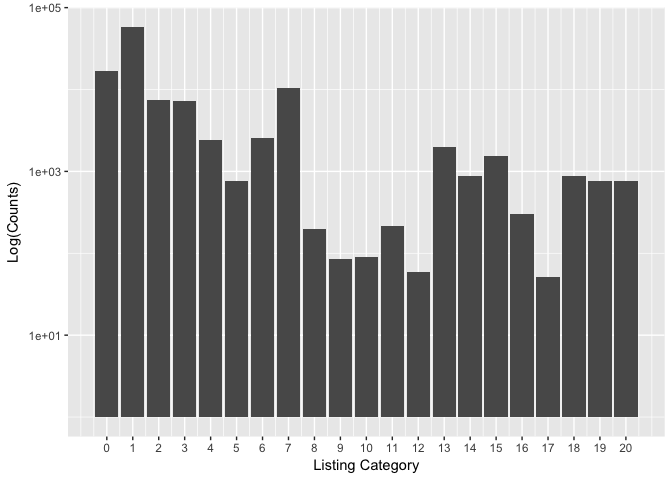
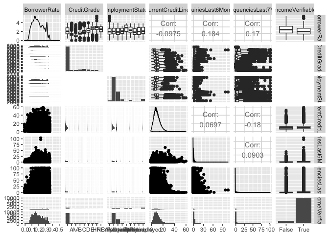
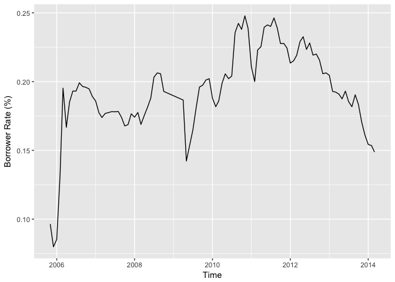
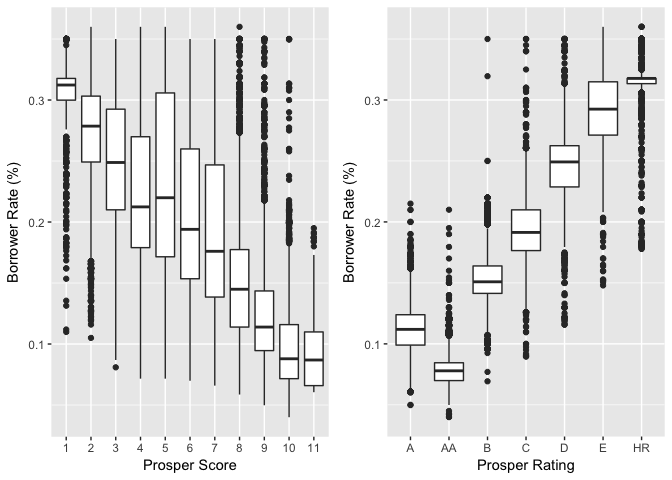

========================================================

Introdcution
============

This project is part of the Udacity Data Analyst Nano Degree Program. I
conducted an Exploratory Data Analysis (EDA) on a data set from
[Prosper](https://www.prosper.com/plp/about/), which is America’s first
marketplace lending platform, with over $9 billion in funded loans.
This [data set](https://s3.amazonaws.com/udacity-hosted-downloads/ud651/%20prosperLoanData.csv) contains 113,937 loans with 81 variables on each loan,  including loan amount, borrower rate (or interest rate), current loan  status, borrower income, borrower employment status, borrower credit  history, and the latest payment information.

The main purposes of this project are to summarize the characteristics of  variables that can affect the loan status and to get some ideas about the  relationships among multiple variables using summary statistics and data  visualizations.

The outline of this project is:

-   Introduction
-   Univariate Plots Section
-   Univariate Analysis
-   Bivariate Plots Section
-   Bivariate Analysis
-   Multivariate Plots Section
-   Multivariate Analysis
-   Final Plots and Summary
-   Reflection

Univariate Plots Section
========================

BorrowerAPR and BorrowerRate
----------------------------

> The **BorrowerRate** (interest rate) refers to the annual cost of a loan to  a borrower and is expressed as a percentage. The interest rate does not  include fees charged for the loan. The **BorrowerAPR** is the annual cost of a loan to a borrower. Unlike an
> interest rate, it includes other charges or fees (such as mortgage  insurance, most closing costs, discount points and loan origination  fees) to reflect the total cost of the loan.

According to above definitions by [Bank of America](https://www.bankofamerica%20.com/home-loans/mortgage/finding-the-right-loan/apr-vs-interest-rate.go),  the distribution of BorrowerAPR and BorrowerRate should be similar with  slight difference since the APR is always higher than the interest rate.

ProsperScore
------------

> **ProsperScore** is a custom risk score built using historical Prosper  data. The score ranges from 1-10, with 10 being the best, or lowest  risk score.

StatedMonthlyIncome
-------------------

> **StatedMonthlyIncome** is the monthly income the borrower stated at the  time when the listing was created.

The histogram plot of the original data is highly right skewed. To find the  outliers that drive data to the left, I used summary function and find that  the maximum value is 1750000, which is likely to be an error. So in the next  plot, I removed the top 1% data from the original and got a more reasonable  plot.

    ##    Min. 1st Qu.  Median    Mean 3rd Qu.    Max. 
    ##       0    3200    4667    5608    6825 1750000

MonthlyLoanPayment
------------------

> **MonthlyLoanPayment** is the monthly payment made by the borrower.

From the histogram I found that most of Prosper loan are less than  1,000 ($), indicates the prospers services are mainly on personal loans.

    ## Warning: Transformation introduced infinite values in continuous y-axis

    ## Warning: Removed 6 rows containing missing values (geom_bar).

ListingCategory
---------------

> **ListingCategory** is the category of listing. Prosper uses numeric  values to represent the categories. The meanings of each number can be  found on the [Documentation](https://www.prosper.com/Downloads/Services%20/Documentation/ProsperDataExport_Details.html).

From the barplot, I found that the most popular services offered by  Prosper are Debt Consolidation, Home Improvement, and Business.

AvailableBankcardCredit
-----------------------

> **AvailableBankcardCredit** is the total available credit via bank card at  the time the credit profile was pulled.

LoanStatus
----------

New variable: check\_defaults
-----------------------------

> In risk management one important job is to build a predictive model to  predict whether the loan will be default or not. So I created a new dummy  variable ‘check\_default’ using ‘0’ to represent a completed loan and ‘1’ to  represent a default or charged off loan. According to [Lending Club](http://%20www.lendacademy.com/the-difference-between-a-default-and-a-charge-off-at-%20lending-club/): In general, a note goes into **Default status**  when it is 121 or more days past due. When a note is in Default status,  **Charge Off** occurs no later than 150 days past due (i.e. No later than 30  days after the Default status is reached) when there is no reasonable  expectation of sufficient payment to prevent the charge off.

Occupation
----------

> **Occupation** is the occupation selected by the Borrower at the time they  created the listing.

Since occupation is a catagorical variable, I first plot the histogram.  The range of the counts for occupations expands from less than 100 to  10,000 magnitude.

To make small changes visible, I plot the barplot of occupation on a log  scale. From the histogram I found the 'Other' and 'Professional'  have the largest counts, but these two options didn't provide us useful  information. So I created subset of the original data and made a bar plot  to visualize the distribution of the occupations.

After removing the 'Others' and 'Professional' data, the top three  occupations counts are 'computer programmer','Excutives', and 'Teacher'.

CreditGrade
-----------

> **CreditGrade** is the credic rating was assigned at the time the listing  went live.

Univariate Analysis
===================

### What is the structure of your dataset?

The dataset has 113937 observations of 81 variables. Data types including  'factor', 'num', and 'int'. Variables are about loan information and  borrower information.

### What is/are the main feature(s) of interest in your dataset?

As a potential borrower, I am interested in the interest rate and APR of the  loan. So I plot this two variables and found their ranges lie between  0.1-0.4. I learned that APR is the interest rate plus some fees, so it is  always a little bit higher than the interest rate. A further investigation  is needed since to find the accurate APR for a particular loan other factors  such as time and personal credit history have to be considered.

Another interesting variable is the LoanStatus, which is the status a loan  described as ‘completed’, ‘chargedoff’, ‘defualt’, ‘current’,  ‘overdue’ et al. This information can be used to build a predictive model  for risk management in bank or financial institution like Prosper. I used a  bar plot to visualize the counts of all status and found that most of loans  are completed. However, about half of the closed loans (exclude current  loans) are marked as ‘chargedoff’ or ‘default’.

### What other features in the dataset do you think will help support your 

investigation into your feature(s) of interest?

To study the borrower interest rate and loan status, I included  ListingCreationDate and some borrower information such as Occupation,  AvailableBankcardCredit, CreditGrade, StatedMonthlyIncome and  DebtToIncomeRatio.

### Did you create any new variables from existing variables in the dataset?

Yes, I first created a new dummy variable 'check\_default' to indicates  whether a loan is completed or not. I also created a Datetime variable 'ListingDateTime' in format of  'yyyy-mm-dd' to indicate the loan listing date.

### Of the features you investigated, were there any unusual distributions? 

Did you perform any operations on the data to tidy, adjust, or change the  form of the data? If so, why did you do this?

The StatedMonthlyIncome is highly right skewed. To find the outliers that  drive data to the left, I used summary function and find that the maximum  value is 1750000, which is likely to be an error. So in the next plot, I  removed the top 1% data from the original and got a more reasonable plot.

Similarly, the AvailableBankcardCredit is also extremely skewed. I first  removed the the top 1% data from the original and result distribution looks  like a gamma distribution. To normalize the data I did a log transformation  on the variable and get a nicer plot, which allows us to better observe the  data behavior.

Bivariate Plots Section
=======================

Scatter matrix plot.
--------------------

Scatter matrix plot is a fast way to compare multiple paired variables at  once. So I first used the ggpairs function to get a general idea of the  correlations amoung the variables. The variables included in the matrix  plot are BorrowerRate (the variable I am interested with) and other  variables associated with the borrowers, such as credit history and  employment status. The scatter matrix shows that the credit grade is  clearly one factor affect the interest rate. The correlation  coefficient of other variables with the interest rate are very small,  therefore, will be excluded from the predictive model.

Time vs. Interest Rate
----------------------

To study how did interest rates change with time, I made a time series  plot using scatter plot. However, the plot failed to illustrate any useful  information since there are too many observations.

Therefore I made the second plot with weekly means. The plot looks better  now but it is too noize.

To reduce the noises, I changed the x unit from Week to Month. Now the  plot shows clearly how interest rates changed over time. However, there's no  obvious seasonal fluctuation or monotonic behaviors. Time may not be a good  independent variable to predict the borrower's interest rate.

Yearly Borrower Rates
---------------------

Prosper Rating vs. BorrowerRate
-------------------------------

> **ProsperScore** is the custom risk score built using historical Prosper  data. The score ranges from 1-10, with 10 being the best, or lowest risk  score. **ProsperRating** is a similar parameter to evaluate a customer's  risk to make default loan.

The plot show strong correlation between the prosper rating/score with the  borrower's rate. Generally, borrowers have no clue on their prosper scores.  So these information can not be included in our model.

AvailableBankcardCredit vs. BorrowerRate
----------------------------------------

> **AvailableBankcardCredit** is total available credit via bank card.  It can be an indicator of a borrower's credit history.

A reasonable guess is that a higher available bank card credit will lower  your interest rate. This guess is proved to be true from following plot.  The points are clustered at the bottom left corner, when a borrower has  relatively low credit amount (&lt;25,000) the probabilities of getting low  and high interest rates are similar. However, when the borrower's credit  amount is high (&gt;50,000), he/she is more likely to get a lower interest rate.

MonthlyLoanPayment vs. Occupations
----------------------------------

The top 3 occupations have high monthly loan payment are Judge, Doctor,  and Pharmacist. The monthly loan payment should be positively correlated  with the salary. The plot is consistent with salaries of each occupation.  For examples, the top 3 listed occupations are all best-paying jobs  accoring to [CNBC](http://www.cnbc.com/2016/07/26/the-25-highest-paying%20-jobs-in-america.\html), and the groups that have lower monthly loan  payment are students.

LoanStatus vs. ProsperRating
----------------------------

> **LoanStatus**is the current status of the loan: Cancelled, Chargedoff,  Completed, Current, Defaulted, FinalPaymentInProgress, PastDue. I created  a new variable 'check\_default' to group the status into two catagories:  0-'completed', 1-'chargedoff' or 'defaulted'.

I plot 'check\_defaulted' Vs. ProsperRating to see if the risk management  system at Prosper really works. As shown on the plot, only a few borrowers  have defaulted loans with Prosper Rating of AA. The proportion of defaulted  loans in the lower rating groups are significant higher. For example, in the  'HR' group the defaulted loan is more than half of the completed loans.

StatedIncome vs. Default
------------------------

In this section, I studied the relationship between the stated income and  the loan status. From the side by side box plot, I found that the mean  stated income of the group that completed the loan is slightly higher than  the other group. However, both group have many outliers and we need to  perfume a statistical test to make the final statement.

    ## loan$check_default: 0
    ## [1] 5324.522
    ## -------------------------------------------------------- 
    ## loan$check_default: 1
    ## [1] 4450.824

Bivariate Analysis
==================

### Talk about some of the relationships you observed in this part of the 

investigation. How did the feature(s) of interest vary with other features  in the dataset?

-   In this section, I first studied variables that may have impacts on the  borrower interest rate. From a scatter matrix plot, I filtered out some  variables like the "CurrentCreditLines", "EmploymentStatus",  "InquiriesLast6Months", and "DelinquenciesLast7Years".

-   Then I made a time series plot of the interest rates and found no clear  seasonal or yearly trends.

-   Two factors that has "significant"" impact on the interest rates are are  "ProsperRating..Alpha." and "ProsperScore".

-   Another feature can be used the predict the interest rata is  "AvailableBankcardCredit" .

### Did you observe any interesting relationships between the other features 

(not the main feature(s) of interest)?

-   I studied the relationships between MonthlyLoanPayment and Occupations  and found the top 3 occupations have high monthly loan payment are those  have higher salaries.

-   I found a strong correlation between the loan status and the Prosper  Rating, indicates that the risk management system at Prosper is efficient.

-   At last I studied the income and defaulted loan, and found no significant  correlation.

### What was the strongest relationship you found?

The strongest relationships I found is the Prosper Rating vs. Loan Status  and the Prosper Score vs. Borrower's rate. Prosper using borrower's credit  history and other information to evaluate their rike score. This score is  represented as Prosper Rating and Prosper score. This feature is proved to  be efficient to predict whether there will be a defaulted loan or not. So  Prosper would be able to use this score to set the borrowe's interest rate. 

Multivariate Plots Section
==========================

Interest Rate vs. Time vs. Catagory
-----------------------------------

From the time series plot in last section, I didn't get useful information  about how the interest rate changes with time. So I included another  variable (listing catagory) here to see if we can find any interesting  trend for individual listings.

The lines for each catagory are similar with the mean plot except one huge  jump for the auto loan in year 2009. But when look back to the first time  series plot, I found there's only a few data point within that time window.  Thus any outlier was able to drive the line up.

Interest Rate vs. Time vs. Homeowner
------------------------------------

> **IsBorrowerHomeowner**: A Borrower will be classified as a homowner if  they have a mortgage on their credit profile or provide documentation  confirming they are a homeowner.

From the following plot, it is clear that the interest rate for homeowners  are generally lower than non-homeowners. Homeowners usually have lower risk  of making defaulted loans since bank can use their house as collateral. 

Multivariate Analysis
=====================

### Talk about some of the relationships you observed in this part of the 

investigation. Were there features that strengthened each other in terms of  looking at your feature(s) of interest?

-   The time seriers plot of borrowers' rates groupby listing catagories  didn't reveal any new findings.

-   However, by adding the Hmeowners information to the time series plot I  found clear tren d that homeowners tend to get lower interest rates.

------------------------------------------------------------------------

Final Plots and Summary
=======================

### Plot One

#### Description One

BorrowerRate and Borrower APR are the variables that I am interested in the  study because they are the most important numbers borrowers care about when  make loan. So I first ploted the distributions of this two variables.  According to above definitions by [Bank of America](https://www.banko%20famerica.com/home-loans/mortgage/finding-the-%20right-loan/apr-vs-interest-rate.go), the distribution of BorrowerAPR and  BorrowerRate should be similar with slight difference since the APR is  always higher than the interest rate. The plots also illustrate similar  distributions.

### Plot Two

#### Description Two

I plot 'check\_defaulted' Vs. ProsperRating to see if the risk management  system at Prosper really works. As shown on the plot, only a few borrowers  have defaulted loans with Prosper Rating of AA. The proportion of defaulted  loans in the lower rating groups are significant higher. For example, in the  'HR' group the defaulted loan is more than half of the completed loans. 

### Plot Three

#### Description Three

In this plot I studied the relationships amoung three variables: borrower  rate, time, and whether the borrower is a homeowner or not. This colored  scatter plot illustrates the fact that the homeowners got lower interest  rate in general throughout the years.

------------------------------------------------------------------------

Reflection
==========

In this project I selected a dataset from Prosper.com which includes 81
variables and 113,937 observations. With so many variable it was hard to  get started without any financial knowledge. Thanks to Propers.com who  provided detailed description for each variable. So the first step before  conducting any data analysis is to understand the meaning of each variable.  After reading through the descriptions and definitions,  I chose ‘BorrowerRate’ as my target variable since this number matters  a lot to a potential borrower.

The next step is to get to know the variables. In R, we can use some  summary functions to get some general ideas about the dataset.  For example str(data) gives us the structure of the dataset,  summary(variable) gives us the summary statistics of variables.  Another approach is to use data visualizations. For individual variable,  histogram and boxplot are good way to show their distributions and  identify outliers.

After get some ideas of individual variable, we can move to next step and  start to explore the relations among variables, especially those related to  our target variable. Scatter plot is most commonly used plot to show  relations between two variables. In this project, I first made a scatter  matrix which shown multiple comparisons at once. From the scatter matrix  we can filter out some variables that have weak correlations with the  target variable. For those have stronger correlations, we can further  study their relationships.

A simple way to show relationships among multi variables is to add colors  to the plot. Using different colors to represent factorial variables. The  point size of the scatter plot can also be used to represent numerical  variables with larger size associated with larger numerical values.

Limitations
-----------

The Exploratory Data Analysis is a good way to know the data using vivid
and interesting visualizations. However, to make final statement about the  relationships among variables we need to conduct statistical test and  build predictive models.
