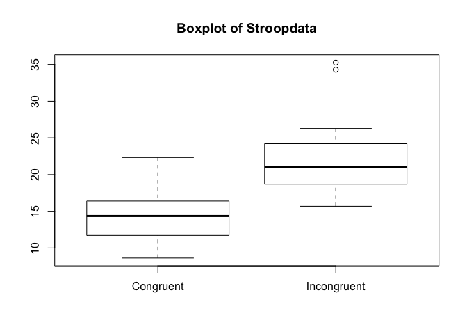
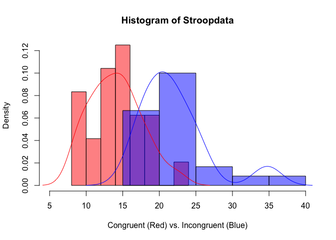

Introduction
============

We may all experienced the same situation when we read a colored word
describe a color: we tend to spend more time to recognize the color of
the word if it is different with what it describes.This phenomenon is
called [Stroop Effect](https://en.wikipedia.org/wiki/Stroop_effect). As
a course project for Udacity Data Analyst Nano Degree, this project will
use basic statistics tools to analyze a dataset from a [Stroop Effect
Experiment](https://faculty.washington.edu/chudler/java/ready.html).

Study Questions
===============

Question 1
----------

**What is our independent variable? What is our dependent variable?**

Our independent variable is the condition when we read the words, which
has two values-*congruent words condition* and *incongruent words
condition* Our dependent variable is the time used to read the words in
second.

Question 2
----------

**What is an appropriate set of hypotheses for this task? What kind of
statistical test do you expect to perform? Justify your choices.**

Let the congruent population response time mean be *μ**C*,
and the incongruent population response time mean be *μ**I*.
Our hypotheses are:
*H*0 : *μ**C* − *μ**I* ≥ 0
*H**a* : *μ**C* − *μ**I* &lt; 0
 The null hypothesis (*H*0) is that the congruent population
response time mean is not significantly less than the incongruent
population response time mean. The alternative hypothesis
(*H**a*) is that the congruent population response time mean
is significantly less than the incongruent population response time
mean.

Since the data were collected from the same participant under two
conditions, I would use a one-way **paired-t test** to test my
hypotheses. However, this method should only be used under the
assumption that the data are normally distributed. We will talk about it
in later section.

Question 3
----------

**Report some descriptive statistics regarding this dataset. Include at
least one measure of central tendency and at least one measure of
variability.**

Use stat.desc function from the pastecs package in R, we can get
following descriptive statistic about the stroop study dataset. The most
common measure of central tendency is mean. From R output, the average
time used under congruent and incongruent conditions are 14.051*s* and
22.016*s* respectively. Standard deviation is a measure of variability.
For this dataset, the standard deviations for the two conditions are
3.559 and 4.797.

    ##    Congruent      Incongruent   
    ##  Min.   : 8.63   Min.   :15.69  
    ##  1st Qu.:11.90   1st Qu.:18.72  
    ##  Median :14.36   Median :21.02  
    ##  Mean   :14.05   Mean   :22.02  
    ##  3rd Qu.:16.20   3rd Qu.:24.05  
    ##  Max.   :22.33   Max.   :35.26

Question 4
----------

**Provide one or two visualizations that show the distribution of the
sample data. Write one or two sentences noting what you observe about
the plot or plots**

Boxplot is an useful visualization to show the distribution of the data,
it is also helpful for detecting outliers! From the Boxplot, we found
that in general the congruent group used less time than the incongruent
group. We also found that there are two outliers in the incongruent
data.

Histogram is another useful plot help us to visualize the distribution
of a data. From following histogram plot, we found that the Congruent
group used less time than the Incongruent group. The distribution of the
Congruent data is normal, while the Incongruent data is right skewed
because of the outliers.

Question 5
----------

**Now, perform the statistical test and report your results. What is
your confidence level and your critical statistic value? Do you reject
the null hypothesis or fail to reject it? Come to a conclusion in terms
of the experiment task. Did the results match up with your
expectations?**

The result from the one-way pairted-t test is as below: my confidence
level is *α* = 0.05, the critical statistic value is *t* = −8.0207.
Because the P-value is less than 0.05, we successfully rejected our Null
hypothesis and conclude that we are 95 confident that it takes a longer
time to read words under incongruent condition than under congruent
condition. The result matched up with my expectation because when I did
the experiment I spent almost twice of the time to read words under
incongruent condition.

    ## 
    ##  Paired t-test
    ## 
    ## data:  Congruent and Incongruent
    ## t = -8.0207, df = 23, p-value = 2.052e-08
    ## alternative hypothesis: true difference in means is less than 0
    ## 95 percent confidence interval:
    ##       -Inf -6.262868
    ## sample estimates:
    ## mean of the differences 
    ##               -7.964792

Question 6
----------

**What do you think is responsible for the effects observed? Can you
think of an alternative or similar task that would result in a similar
effect?**

One possible explanation can be when we see a word we can read it
directly. However, when we see a color we need to first name the color
then read it, which takes longer reaction time.

Some similar tasks may include: uppercase the word, turn the words
upside down *et al.*

### Reference

<https://faculty.washington.edu/chudler/java/ready.html>

<https://en.wikipedia.org/wiki/Stroop_effect>

<https://faculty.washington.edu/chudler/words.html>

<http://support.minitab.com/en-us/minitab/17/topic-library/basic-statistics-and-graphs/hypothesis-tests/tests-of-means/why-use-paired-t/>
