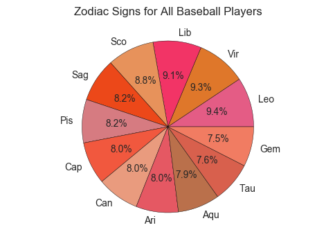
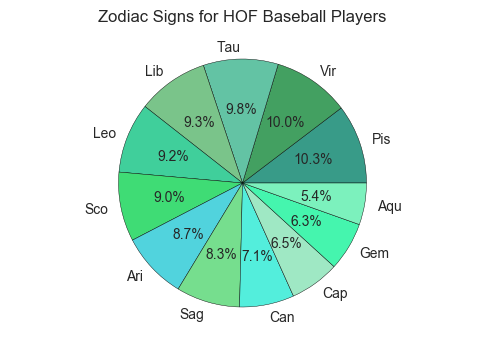
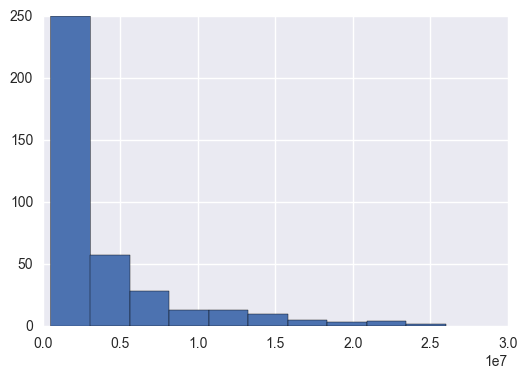
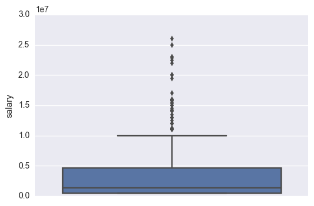
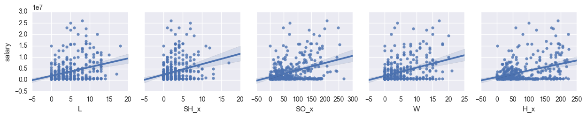

# Baseball Players Analysis

## 1. Introduction

Baseball is a bat-and-ball game origins from Europe. The game turned professional in the US in the mid-1850s. If you are not a fan of this game, you may feel frustrated about the rules and statistics as I did. However, when I had to dig into those statistics for the project, I found baseball is actually a fun game and I may want to watch one someday :)

The data were downloaded from [seanlahman.com](http://seanlahman.com/). I selected 4 main tables and 2 supplemental tables to analyze and try to answer following questions: 

* Question 1. where do baseball players come from? which state in the US has borned the most baseball player? 
* Question 2. what are the zodiac signs of baseball players? Which zodiac sign has more Hall of Fame players? 
* Question 3. what performance statistic relates to the player's salary? 

## 2. Packages and Datasets Description

### 2.1 Packages
The packages I used in this project includes: [numpy](http://www.numpy.org/) and [pandas](http://pandas.pydata.org/) for basic data manipulation; [matplotlib](http://matplotlib.org/), [seaborn](http://seaborn.pydata.org/), and [plotly](https://plot.ly/) for data visulizations. 


```python
# import packages 
import numpy as np
import pandas as pd 
import matplotlib.pyplot as plt
import seaborn as sns
import math
import plotly.plotly as py
import plotly 
plotly.tools.set_credentials_file(username='jianru-shi', api_key='egGiKXaZFDLIOEmCLTBk')
%matplotlib inline

from scipy import stats

```

### 2.2 Datasets

All datasets are downloaded from [seanlahman.com](http://seanlahman.com/). 
For Question 1, I will use the MASTER table only to study the birth states of the baseball players. 
For Question 2, I will use the MASTER and HallofFame tables to compare the zodiac signs of all players with the Hall of Fame palyers. 
For Question 3, I will use the Batting, Pitching, and Salaries tables to analyze the correlations between performance statistics and the salary of the player.

Table Name | Description
--- | --- 
MASTER | Player names, DOB, and biographical info
Batting | batting statistics
Pitching | pitching statistics
HallofFame | Hall of Fame voting data
Salaries | player salary data


```python
# read data from csv files 
master=pd.read_csv('Master.csv')
hall_of_fame=pd.read_csv('HallOfFame.csv')
pitching=pd.read_csv('Pitching.csv')
batting=pd.read_csv('Batting.csv')
salaries=pd.read_csv('Salaries.csv')
```

## 3. Birth States of Baseball Players 


Baseball first came to the US in the east coast in 1791 and then became a national game in 1860s. The first organization governing American baseball is The National Association of Base Ball Players (NABBP), which formed in 1857 at New York City. By 1867, it grown to have over 400 members, including some clubs from as far away as San Francisco and Louisiana. **Do those states that began to play baseball earlier tend to have more baseball players?** 


### 3.1 Approach
From this section, I explored the birth states of all baseball players that bron in the US to answer this question. The summary is plotted on the choropleth map using [plotly](https://plot.ly/). The code for ploting choropleth was revised from [choropleth maps](https://plot.ly/python/choropleth-maps/)


```python
# Clean data for visualize baseball players' birth states in USA
# Select baseball players that were born in USA
players_birth_state=master[['playerID','birthState']][master['birthCountry']=='USA'].dropna()
# Count frequence of baseball players for each state
players_birth_state_counts=players_birth_state['birthState'].value_counts()
# Convert Series to Dataframe and reset index and col-names
players_birth_state_counts=pd.DataFrame(players_birth_state_counts)
players_birth_state_counts.reset_index(level=0, inplace=True)
players_birth_state_counts.columns=['State', 'Counts']
#players_birth_state_counts.head(5)
```


```python
players_total_count=players_birth_state_counts['Counts'].sum()
```


```python
# Use plotly to plot choropleth map *ref 
data = [ dict(
        type='choropleth',
        autocolorscale = True,
        locations = players_birth_state_counts['State'],
        z = players_birth_state_counts['Counts'].astype(float),
        locationmode = 'USA-states',
        text = round((players_birth_state_counts['Counts']/players_total_count)*100,2).astype(str)+'%' ,
        marker = dict(
            line = dict (
                color = 'rgb(255,255,255)',
                width = 2
            ) ),
        colorbar = dict(
            title = "Baseball Players")
        ) ]
```


```python
layout = dict(
        title = 'Birth States of Baseball Players',
        geo = dict(
            scope='usa',
            projection=dict( type='albers usa' ),
            showlakes = True,
            lakecolor = 'rgb(255, 255, 255)'),
             )
```


```python
fig = dict( data=data, layout=layout )
py.iplot(fig)
#click reset button on the topright corner to adjust the size of the map.
```


<iframe id="igraph" scrolling="no" style="border:none;" seamless="seamless" src="https://plot.ly/~jianru-shi/18.embed" height="525px" width="100%"></iframe>


### 3.2 Conclusion 
 
From the choropleth map, it is clear that most baseball players (13%) were born in California, which is one of thoes states that have longer baseball history. Pennsylvania, the origin state of the American baseball, has borned 8.59% baseball players. Other states in northeast, such as New York, Ohio, and Massachusetts, also have more baseball players than states in midwest. 

## 4. Zodiac Signs of Baseball Players 

Whether you are a skeptic or a believer of zodiac stories, the zodiac is always an ice-breaker topic between two strangers. In this section, I analyzed the zodiac signs of all baseball players as well as a comparison with zodiac signs of hall-of-fame players. I wish you could find your chance to become a professional baseball player (or a very standout baseball player) based on your zodiac sign :)   

### 4.1 Approach 

To analyze the zodiac signs of all baseball players, I created a new table (players_birthday) including the ‘playerID’, ‘birthDay‘, and ‘birthMonth’ columns from the MASTER table. I assigned zodiac signs to each player according to their birth dates using the [zodiac_sign function](http://stackoverflow.com/questions/3274597/how-would-i-determine-zodiac-astrological-star-sign-from-a-birthday-in-python). The counts of each sign were plot in a pie chart. 

To analyze the zodiac signs of Hall-of-Fame players, I merged the HallOfFame table with the players_birthday table using ‘inner’ merge method. And conducted similar analysis as before. 


```python
# select useful variables for zodiac analysis
players_birthday=master[['playerID','birthMonth','birthDay']].dropna()
```


```python
players_birthday[['birthMonth','birthDay']]=players_birthday[['birthMonth','birthDay']].astype(int)
```


```python
# define a function of finding zodiac signs *ref 
from bisect import bisect
signs = [(1,20,"Cap"), (2,18,"Aqu"), (3,20,"Pis"), (4,20,"Ari"),
         (5,21,"Tau"), (6,21,"Gem"), (7,22,"Can"), (8,23,"Leo"),
         (9,23,"Vir"), (10,23,"Lib"), (11,22,"Sco"), (12,22,"Sag"),
         (12,31,"Cap")]
def zodiac_sign(df):
    return signs[bisect(signs,(df[0],df[1]))][2]


# define a function to plot the pie chart of frequency of zodiax signs.
# the function takes two arguments: the data to plot and the color theme of the pie chart. 
def zodiac_plot_pie(series,colors,title):
    signs_counts=series.value_counts()
    signs_percentage=signs_counts/signs_counts.count()
    plt.axis("equal")
    _=plt.pie(signs_percentage.values, labels=signs_percentage.index,autopct="%1.1f%%",colors=colors)
    plt.title(title)
    plt.show()

```


```python
# plot the zodiac signs for all baseball players
players_birthday['zodiacSign']=players_birthday[['birthMonth','birthDay']].apply(zodiac_sign, axis=1)
players_signs=players_birthday['zodiacSign']
colors=["#e45c85", "#df772a", "#f23466", "#e7925b","#ec4819","#d67b81","#f1583e",
        "#e99b7e","#e55863","#ba704b","#d8604d","#f17c62"]
zodiac_plot_pie(players_signs,colors,'Zodiac Signs for All Baseball Players')


# plot the zodiac signs for the players that have been selected in Hall of Fame 
HOF_merge_PB=hall_of_fame.merge(players_birthday, how='inner', on='playerID')
fame_players_sign=HOF_merge_PB.zodiacSign
colors=["#389b88","#43a061","#63c3a4","#7ac48a","#40cf9b","#3fdc75",
        "#51d3dd","#76de8e","#53eedc","#9fe8c4","#45f5ae","#7cf1bd"]
zodiac_plot_pie(fame_players_sign,colors, 'Zodiac Signs for HOF Baseball Players')

```








### 4.2 Conclusion

The pie charts demonstrate the distribution of the zodiac signs. 9.4% baseball players are Leo (July 23-Aug 21), and only 7.5% are Gemini (May 22-Jun 21). Is the difference just by chance? According to horoscope, Leo is confident, ambitious, generous, loyal, and encouraging, which all are good characteristics for a baseball player. Gemini is energetic, clever, imaginative, witty, and adaptable, which sounds more like an artist than a baseball player. Skeptics may sniff now, luckily there is an alternative explanation for them. According to Christopher Lee’s article [Birth Month Effect On Baseball Players](http://christopherlee.com/birth-month-effect-on-baseball-players-part-i/), there are more professional players born in August (most likely to be a Leo) because that the Little League Baseball cutoff date for 55 years (up until 2006) was July 31. Given the cutoff date, the player with the birthday in August may has an advantage in size, strength and maturity and thus be selected by more competitive leagues.  

Let’s look at the Hall-of-Fame chart. Leo and Virgo are still more than 9%, Gemini and Aquarius are about 5%, which are consistent with previous observations. However, 10.3% of Hall-of-Fame baseball players are Pisces! The horoscope says Pisces is compassionate, adaptable, accepting, devoted, and imaginative. Except devoted, none of above sounds like sport spirits. Now skeptics laugh :)  Maybe we can think of it in this way: for all professional players, the training they get is similar, their physical condition is also similar so what determines their performances is eventually psychological. For a Pisces, the adaptable and accepting personality may helps them to be standout in critical situations. 

This section is focusing on visualizing the distribution of baseball players’ zodiac signs, thus a hypothesis test on the difference between all players and Hall of Fame players in not conducted. 


## 5. Performance and Salary  

From previous section, you may found yourself is a Leo or a Pisces and delightly decide to be a baseball player later. Before you finally picking a bat you may want to know how much money you can earn and what skills you need to improve to make more money. In this section I first summarized the salary for all baseball players. Then I calculated the correlations between different performance statistics with the salary. 

### 5.1 Approach 

First I merged salaries, batting, and pitching tables on variables 'playerID', 'yearID', 'teamID', and 'lgID' and name the new table ‘players_stats_merge_salaries’. Then I use the describe method of pandas dataframe to get summary of the salary data, and visualized the distribution using a boxplot. Finally I calculated the pearson correlations between all variables with the salary, and visualized the top five correlations.  


```python
# Clean data for baseball players' salary analysis: merge salaries, batting, and pitching tables
players_stats_merge_salaries=salaries.merge(pitching, how='inner', on=['playerID','yearID','teamID','lgID']).dropna()
players_stats_merge_salaries=players_stats_merge_salaries.merge(batting,how='inner', on=['playerID','yearID','teamID','lgID']).dropna()

# Summary and visulization of all baseball players' salaries
players_stats_merge_salaries['salary'].describe()
players_stats_merge_salaries['salary'].hist()
```


    <matplotlib.axes._subplots.AxesSubplot at 0x110a001d0>





```python
_=sns.boxplot(y='salary',data=players_stats_merge_salaries)
```





```python
# Calculate the correlations matrix and find 5 vairables that have the strongest correlation with salaries. 
correlations_with_salary=players_stats_merge_salaries.corr(method='spearman')['salary'].sort_values(ascending=False,inplace=False)
correlations_with_salary[1:6]
```


    L       0.281773
    SH_x    0.273819
    SO_x    0.267977
    W       0.265793
    H_x     0.260326
    Name: salary, dtype: float64


```python
# Visualize the correlations. 
pp = sns.pairplot(data=players_stats_merge_salaries,
                  x_vars=['L','SH_x','SO_x','W','H_x'],
                  y_vars=['salary'],
                 kind="reg"
                 )
```





### 5.2 Conclusion

The minimum salary is 50,000 dollar, the maximum salary is 26,000,000 dollar, the mean salary is 3,500,000 dollar. It seems that professional baseball palyer is a promissing job since even the minmum baseball player income is greater than the US average [personal income](https://en.wikipedia.org/wiki/Personal_income_in_the_United_States), which is 44,510 dollar. 

The five performance statistics that are most positively correlated to the salary are: 

* [Games started](https://en.wikipedia.org/wiki/Games_started) indicates the number of games that a pitcher has started for his team. A pitcher is credited with starting the game if he throws the first pitch to the first opposing batter.

* [Hit](https://en.wikipedia.org/wiki/Hit_(baseball)), also called a base hit, is credited to a batter when the batter safely reaches first base after hitting the ball into fair territory, without the benefit of an error or a fielder's choice.

* [Outs Pitched](https://en.wikipedia.org/wiki/Innings_pitched) is the number of batters and baserunners that are put out while the pitcher is on the pitching mound in a game. 

* [Batters Faced by Pitcher](https://en.wikipedia.org/wiki/Batters_faced_by_pitcher) is the number of batters who made a plate appearance before the pitcher in a game or in a season. 

* [Strikeout](https://en.wikipedia.org/wiki/Strikeout) occurs when a batter accumulates three strikes during a time at bat. It usually means the batter is out. 

From the plots we 


## Reference 

[Baseball history](https://en.wikipedia.org/wiki/History_of_baseball_in_the_United_States)

[Baseball rules](http://m.mlb.com/glossary/standard-stats)

[Zodiac signs function](http://stackoverflow.com/questions/3274597/how-would-i-determine-zodiac-astrological-star-sign-from-a-birthday-in-python)

[Birth Month Effect On Baseball Players](http://christopherlee.com/birth-month-effect-on-baseball-players-part-i/)

[Plot data on python maps](https://plot.ly/python/getting-started/)

[choropleth maps](https://plot.ly/python/choropleth-maps/)
