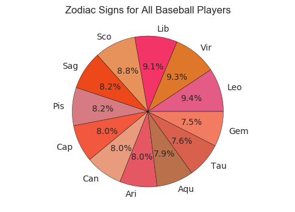
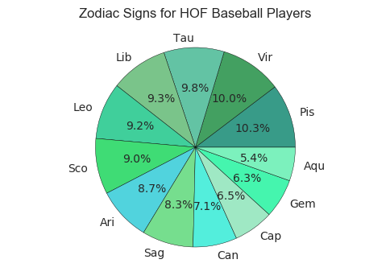

# Baseball Players Analysis

## Introduction

To be filled


```python
# import packages 
import numpy as np
import pandas as pd 
import matplotlib.pyplot as plt
from mpl_toolkits.basemap import Basemap
import seaborn as sns
from geopy.geocoders import Nominatim
import math
import plotly.plotly as py
import plotly 
plotly.tools.set_credentials_file(username='jianru-shi', api_key='egGiKXaZFDLIOEmCLTBk')
%matplotlib inline

```


```python
# read data from csv files 
master=pd.read_csv('Master.csv')
hall_of_fame=pd.read_csv('HallOfFame.csv')
```


```python
# select useful variables for zodiac analysis
players_birthday=master[['playerID','birthMonth','birthDay']].dropna()
```


```python
players_birthday[['birthMonth','birthDay']]=players_birthday[['birthMonth','birthDay']].astype(int)
players_birthday.head(5)
```


<div>
<table border="1" class="dataframe">
  <thead>
    <tr style="text-align: right;">
      <th></th>
      <th>playerID</th>
      <th>birthMonth</th>
      <th>birthDay</th>
    </tr>
  </thead>
  <tbody>
    <tr>
      <th>0</th>
      <td>aardsda01</td>
      <td>12</td>
      <td>27</td>
    </tr>
    <tr>
      <th>1</th>
      <td>aaronha01</td>
      <td>2</td>
      <td>5</td>
    </tr>
    <tr>
      <th>2</th>
      <td>aaronto01</td>
      <td>8</td>
      <td>5</td>
    </tr>
    <tr>
      <th>3</th>
      <td>aasedo01</td>
      <td>9</td>
      <td>8</td>
    </tr>
    <tr>
      <th>4</th>
      <td>abadan01</td>
      <td>8</td>
      <td>25</td>
    </tr>
  </tbody>
</table>
</div>


```python
# define a function of finding zodiac signs *ref 
from bisect import bisect
signs = [(1,20,"Cap"), (2,18,"Aqu"), (3,20,"Pis"), (4,20,"Ari"),
         (5,21,"Tau"), (6,21,"Gem"), (7,22,"Can"), (8,23,"Leo"),
         (9,23,"Vir"), (10,23,"Lib"), (11,22,"Sco"), (12,22,"Sag"),
         (12,31,"Cap")]
def zodiac_sign(df):
    return signs[bisect(signs,(df[0],df[1]))][2]


# define a function to plot the pie chart of frequency of zodiax signs.
# the function takes two arguments: the data to plot and the color theme of the pie chart. 
def zodiac_plot_pie(series,colors,title):
    signs_counts=series.value_counts()
    signs_percentage=signs_counts/signs_counts.count()
    plt.axis("equal")
    _=plt.pie(signs_percentage.values, labels=signs_percentage.index,autopct="%1.1f%%",colors=colors)
    plt.title(title)
    plt.show()

```


```python
# plot the zodiac signs for all baseball players
players_birthday['zodiacSign']=players_birthday[['birthMonth','birthDay']].apply(zodiac_sign, axis=1)
players_signs=players_birthday['zodiacSign']
colors=["#e45c85", "#df772a", "#f23466", "#e7925b","#ec4819","#d67b81","#f1583e","#e99b7e","#e55863","#ba704b",
"#d8604d","#f17c62"]
zodiac_plot_pie(players_signs,colors,'Zodiac Signs for All Baseball Players')


# plot the zodiac signs for the players that have been selected in Hall of Fame 
HOF_merge_PB=hall_of_fame.merge(players_birthday, how='inner', on='playerID')
fame_players_sign=HOF_merge_PB.zodiacSign
colors=["#389b88","#43a061","#63c3a4","#7ac48a","#40cf9b","#3fdc75",
"#51d3dd","#76de8e","#53eedc","#9fe8c4","#45f5ae","#7cf1bd"]
zodiac_plot_pie(fame_players_sign,colors, 'Zodiac Signs for HOF Baseball Players')

```








```python
# Clean data for visualize baseball players' birth states in USA
# Select baseball players that were born in USA
players_birth_state=master[['playerID','birthState']][master['birthCountry']=='USA'].dropna()
# Count frequence of baseball players for each state
players_birth_state_counts=players_birth_state['birthState'].value_counts()
# Convert Series to Dataframe and reset index and col-names
players_birth_state_counts=pd.DataFrame(players_birth_state_counts)
players_birth_state_counts.reset_index(level=0, inplace=True)
players_birth_state_counts.columns=['State', 'Counts']
#players_birth_state_counts.head(5)
```


<div>
<table border="1" class="dataframe">
  <thead>
    <tr style="text-align: right;">
      <th></th>
      <th>State</th>
      <th>Counts</th>
    </tr>
  </thead>
  <tbody>
    <tr>
      <th>0</th>
      <td>CA</td>
      <td>2160</td>
    </tr>
    <tr>
      <th>1</th>
      <td>PA</td>
      <td>1417</td>
    </tr>
    <tr>
      <th>2</th>
      <td>NY</td>
      <td>1207</td>
    </tr>
    <tr>
      <th>3</th>
      <td>IL</td>
      <td>1054</td>
    </tr>
    <tr>
      <th>4</th>
      <td>OH</td>
      <td>1035</td>
    </tr>
  </tbody>
</table>
</div>


```python
# Use plotly to plot choropleth map *ref 

data = [ dict(
        type='choropleth',
        autocolorscale = True,
        locations = players_birth_state_counts['State'],
        z = players_birth_state_counts['Counts'].astype(float),
        locationmode = 'USA-states',
        text = players_birth_state_counts['State'],
        marker = dict(
            line = dict (
                color = 'rgb(255,255,255)',
                width = 2
            ) ),
        colorbar = dict(
            title = "Baseball Players")
        ) ]
```


```python
layout = dict(
        title = 'Statistic of Baseball Players',
        geo = dict(
            scope='usa',
            projection=dict( type='albers usa' ),
            showlakes = True,
            lakecolor = 'rgb(255, 255, 255)'),
             )
```


```python
fig = dict( data=data, layout=layout )
py.iplot(fig)
```


<iframe id="igraph" scrolling="no" style="border:none;" seamless="seamless" src="https://plot.ly/~jianru-shi/4.embed" height="525px" width="100%"></iframe>


```python
## Reference 

[Zodiac signs function](http://stackoverflow.com/questions/3274597/how-would-i-determine-zodiac-astrological-star-sign-from-a-birthday-in-python)
[Plot data on python maps](https://plot.ly/python/getting-started/)
```


      File "<ipython-input-103-d89c885da489>", line 3
        [Zodiac signs function](http://stackoverflow.com/questions/3274597/how-would-i-determine-zodiac-astrological-star-sign-from-a-birthday-in-python)
                    ^
    SyntaxError: invalid syntax


```python

```
