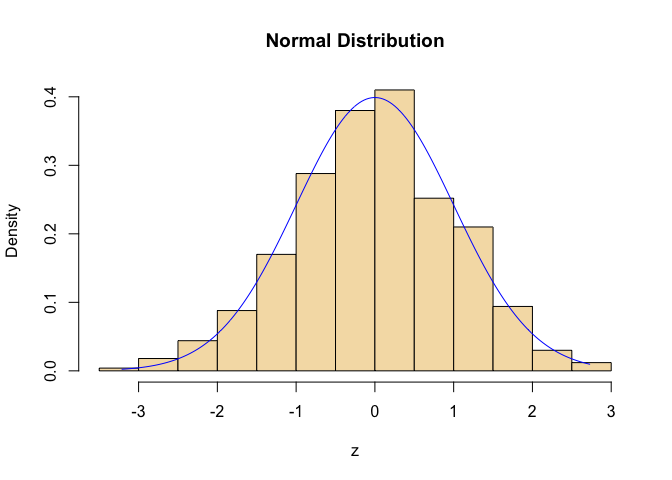
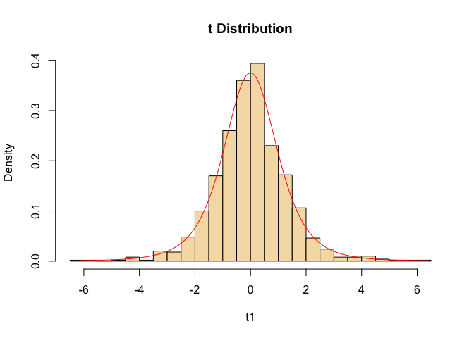
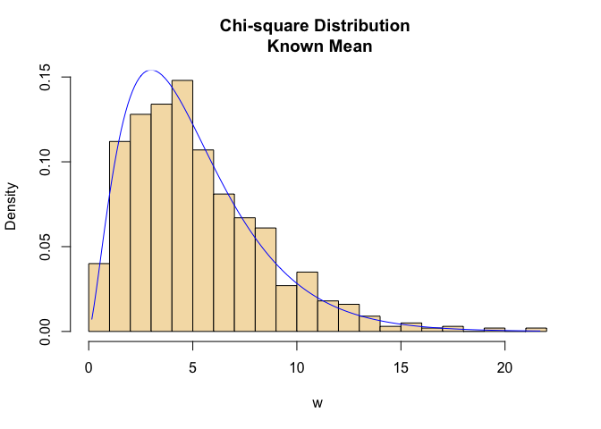
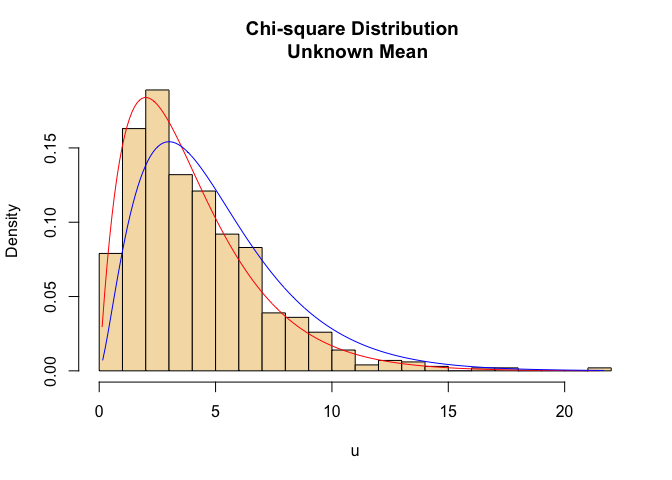
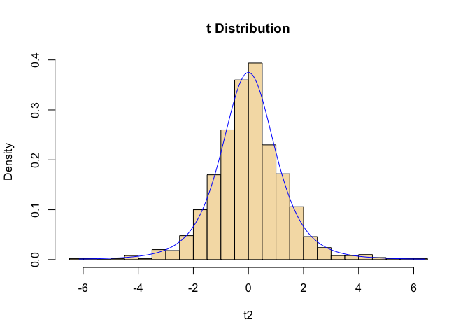
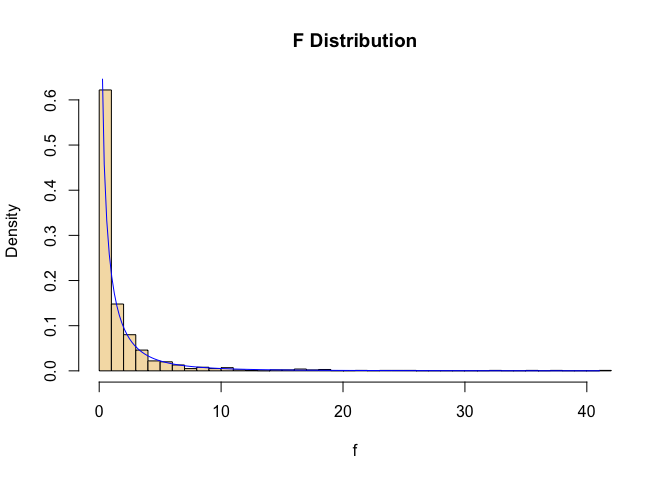

**Keyword: distributions, simulation, R, statistical tests, random
sample**

**Abstract**

*What are differences and connections among normal test (Z test),
student t test, and the F test* is a question for many beginners in
statistics. To answer this question, we first need to get familiar with
four important distributions: normal distribution, student t
distribution, Chi square distribution, and F distribution. This project
provided a simulation method aside of the mathematical derivations to
illustrate the connections among the four distribution, and further to
gain understanding on different statistical tests. Examples in this
project are based on a simple scenario when we want to decide whether or
not the n=5 samples are all from the same population, which is normally
distributed with mean equals to 10 and standard deviation equals to 5.

**1. Normal Distribution and Student t Distribution**

Given a population X is normally distributed with
Normal(*μ* = 10, *σ* = 5), the procedure of repeatedly taking samples
from a normally distributed population can be illustrated by following
simulation (Suess and Trumbo, 2010):

    #project 
    #settings
    set.seed(10)                #set start point of random process
    n=5; mu=10; sigma=5         #set parameters 
    m=1000                      #number of iterations 
    xbar=numeric()              #a vector stores means 
    xsd=numeric()               #a vector stores standard deviations
    w=numeric()                 #a vector stores statistic W
    for (i in 1:m) {            #
      x=rnorm(n, mu, sigma)     #repeat sampling procedures for m times
      w[i]=sum((x-mu)^2/sigma^2)#calculate and store statistic W,
      xbar[i]=mean(x)           #means, 
      xsd[i]=sd(x)              #standard deviations.
    }                           #

**1.1 Normal distribution for statistic Z**

Assume the population X is normally distributed with known mean and
standard deviation. When we repeatedly select n random samples from X,
the means of these random samples are normally distributed with
Normal$(\\mu =10, \\sigma =\\frac{5}{\\sqrt{n}})$. Therefore the
statistic Z$=\\frac{\\bar X -\\mu}{\\sigma/\\sqrt{n}}$ is a standard
normal distribution (Hogg. et al, 2014).

To check the distribution of the statistic Z, we can calculate
Z$=\\frac{\\bar X -\\mu}{\\sigma/\\sqrt{n}}$ and plot the histogram of
Z. Then compare it with the plot of normal distribution. Figure 1.1
shows the results using following simulation (Suess and Trumbo, 2010).

    z=(xbar-mu)/(sigma/sqrt(n)) #calcuate statistic z 
    t1=(xbar-mu)/(xsd/sqrt(n))
    u=(n-1)*xsd^2/sigma^2
    t2=z/sqrt(u/4)
    f=t1^2

    hist(z,prob=T,col="wheat",main="Normal Distribution")
    zz=seq(min(z),max(z),length=200)
    z_dens=dnorm(zz)
    lines(zz,z_dens,col="blue")

Figure 1.1. The histogram of z statistics calculated using simulated
sample means. Blue line shows the pdf of Normal(0,1)

Figure 1.1 shows good fit of the histogram to the density function of
standard normal distribution, suggests the statistic Z has a standard
normal distribution. To further verify this conclusion, we conducted a
Kolmogorov-Smirnov goodness-of-fit test (Wang, et al. 2015). The P-value
from the test is 0.945, indicate a good fit.

    ks.test(z, pnorm)

    ## 
    ##  One-sample Kolmogorov-Smirnov test
    ## 
    ## data:  z
    ## D = 0.021016, p-value = 0.7691
    ## alternative hypothesis: two-sided

**1.2 Student-t Distribution for Statistic T** We just talked about a
situation when a population is normal distribution with k nown mean and
standard deviation. What if we don’t have information on the standard
deviation? Since the standard deviation of samples (s) is an unbiased
estimator of population standard deviation *σ* (Hogg, et al. 2014B), it
is reasonable to substitute statistic
T$=\\frac{\\bar X -\\mu}{s/\\sqrt{n}}$ for Z.

Does the statistic T has the same distribution as Z? To illustrate the
answer, we can calculate and plot T, then compare it with the plot of
normal distribution as we did for Z. Results from following simulation
are shown in Figure 1.2.

    hist(t1,breaks=30,prob=T,col="wheat",main="t Distribution")
    tt1=seq(min(t1),max(t1),length=200)
    t1_dens=dt(tt1,4)
    lines(tt1,t1_dens,col="red")

Figure 1.2 The histogram of z statistics calculated using simulated
sample means. Blue line shows the pdf of Normal(0,1). Red line shows the
pdf of t distribution with 4 degree of freedom.

As shown in Figure 1.2, the histogram of T doesn’t has a good fit to the
density function of the standard normal distribution, which is plotted
in blue line. Instead, it has a good fit to the density function of
Student-t distribution with 4 degree of freedom as shown in the red
line. For additional verification, following code performs
Kolmogorov-Smirnov test of goodness-of-fit for both situations. The
P-value for testing the goodness-of-fit for standard normal distribution
is 0.03128, suggests a lack of fit. While the P-value for testing the
goodness-of-fit for Student-t distribution is 0.8952, indicate a good
fit.

    ks.test(t1, pt,4)

    ## 
    ##  One-sample Kolmogorov-Smirnov test
    ## 
    ## data:  t1
    ## D = 0.018193, p-value = 0.8952
    ## alternative hypothesis: two-sided

Go back to the question that whether or not the 5 random samples are
taken from the same population. First we should consider what
information are given for the population. With small samples (large
samples follows the Law of Large Number, which is not considered in this
project ) taken from a normally distributed population with known mean
and standard deviation,we should use Z as a test statistic. If the
standard deviation of the population is not given, we should use T
instead.

**2. Normal Distribution and Chi-square Distribution**

**2.1 Chi-square distribution for statistic W**

According to corollary by Hogg. et al. (2014B), if
*X*1, *X*2, ..., *X**n* are independent
and have normal distributions
N(*μ**i*, *σ**i*2), where i = 1, 2,
..., n , respectively, then the distribution of
W$=\\sum \\frac{(X\_i-\\mu\_i)^2}{\\sigma\_i^2}$ is a Chi-square
distribution with n degree of freedom To illustrate this corollary, we
use the similar settings as in section 1. To check the distribution of
the statistic W, we plot the histogram of W. Then compare it with the
plot of density function of *χ*(5)2. Figure 2.1
shows the results using following simulation (Suess and Trumbo, 2010).

    hist(w,breaks=30,prob=T,col="wheat",main="Chi-square Distribution \n Known Mean")
    ww=seq(min(w),max(w),length=200)
    w_dens=dchisq(ww,5)
    lines(ww,w_dens,col="blue")

Figure 2.1. Histogram of statistic W calculated from repeatedly and
randomly taking n=5 samples from a population with known mean and
standard deviation,Normal(μ = 10,σ = 5). Blue line shows the density
function of Chi-square distribution with df=5

Figure 2.1 shows good fit of the histogram to the density function of
*χ*(5)2 , suggests the statistic W has a
Chi-square distribution. To further verify this conclusion, we conducted
a Kolmogorov-Smirnov goodness-of-fit test (Wang, et al. 2015). The
P-value from the test is 0.4425, indicate a good fit.

    ks.test(w, pchisq,5)

    ## 
    ##  One-sample Kolmogorov-Smirnov test
    ## 
    ## data:  w
    ## D = 0.040517, p-value = 0.075
    ## alternative hypothesis: two-sided

**2.2 Chis-quare distribution for statistic U** When the population
mean, *μ*, in W$=\\sum \\frac{(X\_i-\\mu\_i)^2}{\\sigma\_i^2}$ is
replaced by the sample mean, $\\bar X$, we get a new statistic
U=$\\sum \\frac{(X\_i-\\bar X)^2}{\\sigma\_i^2}$ Since the sample
variance, $S^2=\\frac{1}{n-1}\\sum(X\_i-\\bar X)^2$ we can use the
sample standard deviations we got from previous sections to calculate
the statistic U and plot the its histogram as follow.

As shown in Figure 2.2, the histogram of U doesn’t has a good fit to the
density function of *χ*(5)2 , which is plotted in
blue line. Instead, it has a good fit to the density function of
*χ*(4)2 as shown in the red line.

    hist(u,breaks=30,prob=T,col="wheat",main="Chi-square Distribution \n Unknown Mean")
    uu=seq(min(u),max(u),length=200)
    u_dens=dchisq(uu,4)
    lines(uu,u_dens,col="red")
    lines(ww,w_dens,col="blue")

Figure 2.2. Histogram of statistic U calculated from repeatedly and
randomly taking n=5 samples from Normal(μ = 10,σ = 5)using sample mean
replace for population mean. Blue line shows the density function of
Chi-square distribution with df=5, red line shows the density function
of Chi-square distribution with df=4.

For additional verification, following code performs Kolmogorov-Smirnov
test of goodness-of-fit for both situations. The P-value for testing the
goodness-of-fit for *χ*(5)2 is &lt;0.001, suggests
a lack of fit. While the P-value for testing the goodness-of-fit for
*χ*(4)2 is 0.1714, indicate a good fit.

    ks.test(u, pchisq,5)

    ## 
    ##  One-sample Kolmogorov-Smirnov test
    ## 
    ## data:  u
    ## D = 0.13247, p-value = 1.11e-15
    ## alternative hypothesis: two-sided

    ks.test(u, pchisq,4)

    ## 
    ##  One-sample Kolmogorov-Smirnov test
    ## 
    ## data:  u
    ## D = 0.035043, p-value = 0.1714
    ## alternative hypothesis: two-sided

As conclusion, when the population mean, *μ* , in
W$=\\sum \\frac{(X\_i-\\mu\_i)^2}{\\sigma\_i^2}$ is replaced by the
sample mean, $\\bar X$, one degree of freedom is lost. The statistic U
is useful to test the variability of a population (Ott and Longnecker,
2015).

**3. Student-t distribution and Chi-square distribution**

We have discussed the normal distribution and Chi-square distribution,
we are now able to explore the connection between the Student-t
distribution and Chi-square distribution. According to Hogg et al.
(2014C), statistic $T=\\frac{Z}{\\sqrt{U/r}}$ has a t distribution with
r degrees of freedom.

To illustrate this relation, we calculated the statistic T using Z and
U, which are statistics for Normal(0,1) and
*χ*(4)2 respectively. Following code calculated
statistic T and plot the histogram of T. Results are shown in Figure
3.1. The histogram in Figure 3.1 is identical to Figure 1.2.

    hist(t2,breaks=30,prob=T,col="wheat",main="t Distribution")
    tt2=seq(min(t2),max(t2),length=200)
    t2_dens=dt(tt2,4)
    lines(tt2,t2_dens,col="blue")

Figure 3.1 The histogram of T statistic calculated using simulated
sample means. Blue line shows the pdf of t distribution with 4 degree of
freedom.

**4. Student-t distribution and F distribution**

In section 3, we proved the relation between t distribution and
Chi-square distribution: $T=\\frac{Z}{\\sqrt{U/r}}$. If square T,we get
$T^2=\\frac{Z^2}{U/r}$, where *Z*2 is
*χ*(1)2, thus *T*2 can be written as
the ratio of two Chi-square statistics divided by their degree of
freedoms : $T^2=\\frac{\\chi\_{(1)}^2/1}{\\chi\_{(r)}^2/r}$, which
prossess a F distribution with degree of freedom *d**f*1 = 1
and *d**f*2 = *r* (Ott and Longnecker, 2015). In our
example,$T^2=\\frac{\\chi\_{(1)}^2/1}{\\chi\_{(4)}^2/4}$. To illustrate
this relation, statistic F is calculated using T, and its distribution
is plotted as below.

Figure 4.1 shows good fit of the histogram to the density function of F
distribution, suggests the statistic F has a F distribution with
*d**f*1 = 1 and *d**f*2 = 4.

    f=t1^2
    hist(f,breaks=30,prob=T,col="wheat",main="F Distribution")
    ff=seq(min(f),max(f),length.out = 200)
    f_dens=df(ff,1,4)
    lines(ff,f_dens,col="blue")

Figure 4.1. The histogram of F statistic calculated using statistics T.
Blue line shows the pdf of F distribution with df1=1 and df2=4.

To further verify this conclusion, we conducted a Kolmogorov-Smirnov
goodness-of-fit test (Wang, et al. 2015). The P-value from the test is
0.5917, indicates a good fit.

    ks.test(f, pf,1,4)

    ## 
    ##  One-sample Kolmogorov-Smirnov test
    ## 
    ## data:  f
    ## D = 0.024385, p-value = 0.5917
    ## alternative hypothesis: two-sided

**5. Summary**

The t test is used to test whether two means are from the same normally
distributed population. F test is useful when there are more than two
means. Two variations, the variation between groups and variation within
group, are calculated and compared in the F distribution. If the
variation between group is significantly greater than the variation
within group, we conclude that not all means are from the same normal
distribution. When there are only two means to compare, the F statistic
is equivalent to the *T*2.
